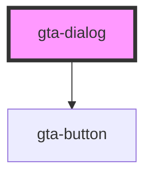

# gta-dialog

<!-- Auto Generated Below -->

## Properties

| Property      | Attribute      | Description | Type      | Default     |
| ------------- | -------------- | ----------- | --------- | ----------- |
| `buttons`     | `buttons`      |             | `string`  | `undefined` |
| `headerTitle` | `header-title` |             | `string`  | `undefined` |
| `isOpen`      | `is-open`      |             | `boolean` | `false`     |

## Events

| Event        | Description | Type               |
| ------------ | ----------- | ------------------ |
| `openChange` |             | `CustomEvent<any>` |

## Dependencies

### Depends on

- [gta-button](../gta-button)

### Graph

----------------------------------------------

